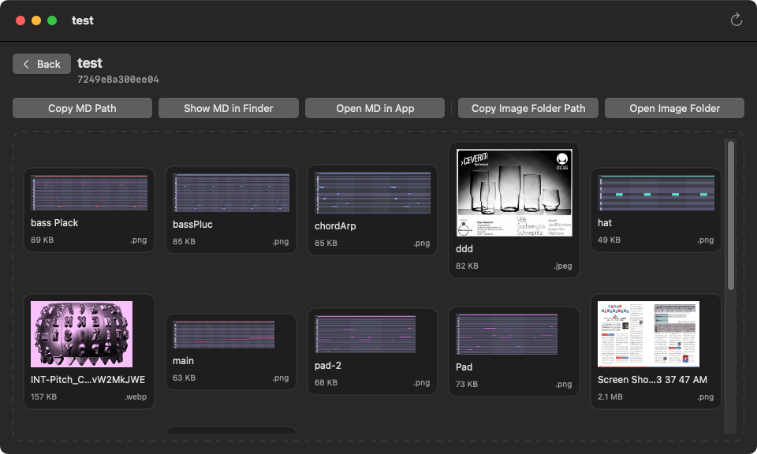
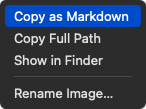

# SlugDock

- Zennの記事と画像をtitle・slug単位で管理するmacOSアプリ
- Zenn CLIに足りない機能を補う

## 📌 主な機能

- 記事のtitle・slug・変更日を一覧表示
- リポジトリルートのFinder表示と絶対パスのコピー
- 選択したアプリでMarkdownを開く
- Markdownと画像フォルダのFinder表示
- ファイルパスのクリップボードコピー
- 画像のドラッグ＆ドロップ追加
- 画像ファイル名の変更
- Zenn用画像Markdownをコピー

## 📌 記事一覧

- titleまたはslugで記事を検索できる。
- Statusプルダウンで`published`のステータスをフィルタ。
    - `All`: すべての記事
    - `Draft`：`published: false`
    - `Published`：`published: true`
    - `Unset`：`published`が空
    - `Errors`：`published`がBool値以外
- 記事を選択し`Return`キーを押すか、ダブルクリックするとWorkspace画面を開く。


### ツールバーのボタン

左から順に:

- ZennリポジトリをFinderで開く
- Zennリポジトリルートの絶対パスをクリップボードへコピーする
- Zennリポジトリを変更する
- 一覧を更新

## 📌 Workspace



### 上部のボタン

- `Copy MD Path`: MDファイルの絶対パスをコピー
- `Show MD in Finder`: MDファイルをFinderで表示
- `Open MD in App`: MDファイルをアプリで開く
    - アプリを変更する場合は、`Actions`メニュー > `Change Markdown App…`を選択。
- `Copy Image Folder Path`: 記事に対応する画像フォルダの絶対パスをコピー
- `Open Image Folder`: 記事に対応する画像フォルダ（`images/[slug]/`）をFinderで開く

```
├─ articles
│  └── [slug].md
└─ images
   └── [slug]
       └─ image1.png
```

### 画像

破線のエリアに画像をドロップすると、記事に対応する画像フォルダへ画像を追加する。

- 対応画像形式: `PNG`, `JPEG`, `GIF`, `WebP`
- 1ファイルあたり3MB以下
- 同名のファイルが存在する場合は上書きせず、ファイル名に`-2`、`-3`と連番を付けて保存する

コンテキストメニューまたはキーボードショートカットで次の操作が可能。

- Zenn用画像Markdownをコピー
- 絶対パスをコピー
- Finderで表示
- ファイル名を変更



| ショートカット | 操作 |
|---|---|
| `⌘⇧C` | Zenn用画像Markdownをコピー |
| `⌥⌘C` | 絶対パスをコピー |
| `⌘⇧R` | Finderで表示 |
| `Return` | ファイル名を変更 |

## 📌 開発環境

- macOS 15.0以降
- Xcode 26.3
- Swift 6
- SwiftUI / AppKit
- Yams 6.2.2（Swift Package Manager）

## 📌 ビルドと起動

1. `SlugDock.xcodeproj`をXcodeで開く
2. Schemeで`SlugDock`、実行先で`My Mac`を選択する
3. `⌘B`でビルドする
4. `⌘R`でビルドしたアプリを起動する

標準のDebug構成では、アプリは次の場所に生成される。`<識別子>`にはXcodeがプロジェクトごとに付ける文字列が入る。

```text
~/Library/Developer/Xcode/DerivedData/SlugDock-<識別子>/Build/Products/Debug/SlugDock.app
```

初回ビルド時は依存パッケージを取得するため、ネットワーク接続が必要になる。

コマンドラインでテストする場合:

```sh
xcodebuild test \
  -project SlugDock.xcodeproj \
  -scheme SlugDock \
  -destination 'platform=macOS,arch=arm64'
```

## 📌 アンインストール

1. SlugDockを終了する
2. `SlugDock.app`を保存場所からゴミ箱へ移動する
3. ターミナルで次のコマンドを実行し、設定ファイル`~/Library/Preferences/local.SlugDock.plist`を削除する

```sh
defaults delete local.SlugDock
```

設定ファイルには、リポジトリルート、Markdownを開くアプリ、ウインドウサイズの設定が保存されている。

## 📌 ライセンス
MIT License — 詳細は [LICENSE](./LICENSE) を参照。
